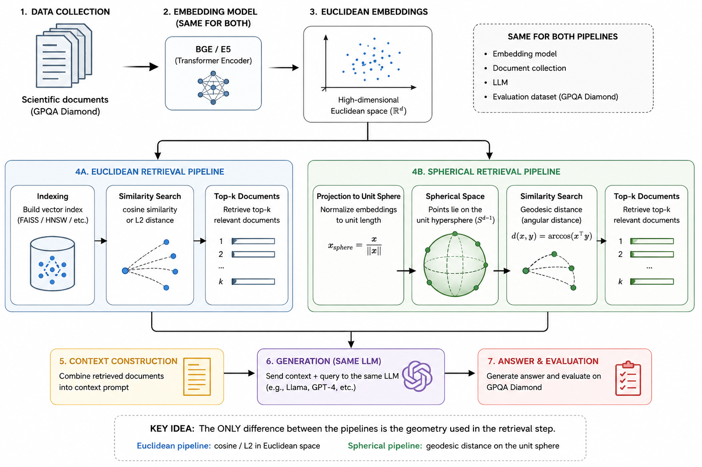

# 🚀 Chat Docs AI

### *Chat with your DOCS using Private, Cloud Agnostic GenAI Platform*

> **A secure, cloud-agnostic GenAI platform to unlock insights from internal documents using RAG.**


---

## 📖 Project Overview

We deliver a **secure, cloud-agnostic GenAI platform** that allows organizations to unlock insights from internal documents — **without exposing data to external AI providers**.

Built entirely on open-source technologies, this solution runs in your own cloud or on-prem infrastructure, giving you full control over data, models, and security.

---

## 🛠️ What the System Does

Simply upload your documents (`PDFs`, `reports`, `policies`, `technical files`, etc.) into secure **MinIO object storage**, and intelligent AI agents can:

*   🔍 **Answer questions** based on your internal knowledge.
*   🧠 **Perform semantic search** across all documents.
*   ⚠️ **Identify risks**, summaries, and analytics via text requests.

---

## 🔐 Security First

**All processing happens inside your environment.**
No third-party APIs, no data sharing, and no external LLM calls. Your data stays within your perimeter.

---

## 🏗️ Technology Stack

| Layer | Component |
| :--- | :--- |
| **Orchestration** | Apache Airflow |
| **Backend & APIs** | Python, FastAPI, REST, Swagger |
| **Storage** | MinIO (Object), PostgreSQL (Structured) |
| **Vector Search** | Qdrant (Embeddings & Semantic Retrieval) |
| **AI Layer** | LangChain + Ollama with Private LLM models |
| **Capabilities** | Embeddings, RAG, AI Agents |

---

## ✨ Key Advantages

- 🛡️ **Security-first architecture** – Data never leaves your perimeter.
- ☁️ **Cloud agnostic** – Deploy on AWS, Azure, GCP, or on-prem.
- 🔒 **Private GenAI** – Uses your own LLM models by default.
- 📄 **Document intelligence** – Built specifically for PDF-heavy environments.
- 🧩 **Scalable & modular** – Extend with new agents, models, and pipelines.

---

## 📂 Ideal For

Organizations handling sensitive documents in areas such as:
*   ✅ **Risk analysis**
*   ✅ **Compliance & policy review**
*   ✅ **Internal knowledge management**
*   ✅ **Operational analytics**

---

## 💡 The Result

A private, enterprise-grade AI knowledge system that turns your documents into a **secure, searchable, and intelligent decision-support layer**.

### Instead of digging through folders, users simply:

> 🗨️ **Ask** questions in plain language.
> 🔍 **Search** across all documents at once.
> 🎯 **Identify** risks, gaps, and key insights instantly.

### 🌟 Experience the change:
- *“What risks are mentioned in our supplier contracts?”* → **Instant overview**
- *“Summarize the main points of pre-sales”* → **Short, structured summary**
- *“What does our policy say about data retention?”* → **Clear answer with context**

---

***Transform your static PDF collection into a searchable, interactive knowledge base using Airflow, Qdrant, and Private LLMs.***


## 🚀 Getting Started

Follow these simple steps to get your intelligent PDF pipeline up and running.

### 1. Setup env

```bash
uv venv
source .venv/bin/activate
uv pip install -r requirements.txt
```

Init `.env` files from templates:
```bash
cp services/chat-docs-service/.env.dev services/chat-docs-service/.env
cp services/typing-pdf-extractor-service/.env.dev services/typing-pdf-extractor-service/.env
```

### 2. Launch Infrastructure
Spin up all services (Postgres, MinIO, Airflow, Qdrant, and Microservices):
```bash
docker-compose up -d
```

### 2. wait for ollama download model and to be ready
```bash
docker logs -f ollama-llm-chat
```
```bash
✅ Ollama is ready and model 'tinyllama' is active.
```

### 3. Configure Airflow
Create your admin credentials to access the dashboard:
```bash
docker exec -it airflow-api-server airflow users create \
  --username admin --password admin \
  --firstname Admin --lastname Admin \
  --role Admin \
  --email admin@example.com
```

### 4. Upload Your Documents
1.  Open **[MinIO Console](http://localhost:9001)** (Login: `minioadmin` / `minioadmin`).
2.  Create a bucket named **`bucket_name`**.
3.  Upload your PDF files into this bucket.

### 5. Process the PDFs
1.  Open the **[Airflow UI](http://localhost:8080/dags)** (Login: `admin` / `admin`).
2.  Locate the **`minio_pdf_processor_dag`**.
3.  **Unpause** it and click **Trigger** to start extracting data and generating embeddings.

### 6. Chat with Your Data
Once processing is complete, test your RAG pipeline via the modern **[Chat UI](http://localhost:8081)**.

For advanced users, the backend documentation is also available:
- **[Search API Swagger](http://localhost:8003/docs)**

---

## 📖 Project Overview

This project implements a complete **Retrieval-Augmented Generation (RAG)** pipeline. It automates the ingestion of PDF documents, extracts semantic information, and enables natural language querying.

- **Orchestration**: Managed by **Apache Airflow 3.x**.
- **Storage**: Files in **MinIO**, Metadata in **Postgres**, Vectors in **Qdrant**.
- **AI Engine**: Local LLM and Embeddings via **Ollama** (`tinyllama` for chat, `nomic-embed-text` for vectors).

### 🏗 Architecture At a Glance

The system is composed of the Airflow ecosystem and specialized microservices:
- **Chat UI Service**: `./services/chat-docs-ui` (Modern Frontend using Nginx)
- **Chat Docs Service**: `./services/chat-docs-service` (FastAPI + RAG Logic)
- **Extraction Service**: `./services/typing-pdf-extractor-service` (FastAPI + OCR/Extraction)
- **Vector DB**: `qdrant-vector-db` (Qdrant)
- **Metadata DB**: `pg-typing-pdf-extractor-db` (Postgres)
- **Airflow DB**: `pg-airflow-db` (Postgres)
- **Object Storage**: `minio` (MinIO)
- **Embedding/LLM Chat**: Ollama services (`ollama-llm-embedding`, `ollama-llm-chat`)

---

## Airflow Orchestration

Airflow is the heart of the project, coordinating data movement and processing.

### 📋 DAG Catalog

- **`minio_pdf_processor_dag`**: The primary pipeline. It monitors MinIO buckets for new PDF uploads and triggers the extraction microservice to process them in real-time.
- **`hello_world_dag`**: A simple diagnostic DAG to verify scheduler health.
- **`debug_test_dag`**: Used for testing internal API connections and core Airflow variables.

### 🛠 Working with DAGs

#### Adding New Logic
1.  Place your `.py` files in the `./dags` folder.
2.  The **DAG Processor** will automatically detect and serialize them within seconds.
3.  Check the status via CLI:
    ```bash
    docker exec -it airflow-api-server airflow dags list
    ```

#### Monitoring & Logs
Tracking task execution is critical. Use these commands to inspect the scheduler's behavior:
```bash
# Check if the scheduler sees your file
docker logs airflow-scheduler | grep your_dag_name.py

# Get logs for a specific task instance
docker exec -it airflow-scheduler airflow tasks logs <dag_id> <task_id> <run_id>
```

#### Manual Triggering & Testing
Sometimes you need to bypass the sensor and run a DAG immediately:
```bash
# Test a specific task without running the whole DAG
docker exec -it airflow-api-server airflow tasks test <dag_id> <task_id> 2024-01-01

# Trigger a full DAG run
docker exec -it airflow-scheduler airflow dags trigger <dag_id>
```

---

## 📁 Project Organization

This project follows a **Microservice Architecture** and **12-Factor App** principles, ensuring that each component is independent, containerized, and easily configurable.

### 🏗 Repository Structure

```text
chat_docs_AI/
├── dags/                     # Airflow DAGs (orchestration logic)
│   ├── minio_pdf_processor_dag.py
│   └── ...
├── services/                 # Core Microservices
│   ├── chat-docs-service/    # RAG backend (FastAPI)
│   ├── chat-docs-ui/         # Web interface (Nginx)
│   ├── embedding-service/    # SQL to Vector ingestion logic
│   └── typing-pdf-extractor-service/ # PDF parsing & metadata
├── llm_services/             # AI Engine Runners (Ollama)
│   ├── ollama-llm-chat/      # TinyLlama chat service
│   └── ollama-llm-embedding/ # nomic-embed-text embedding service
├── volumes/                  # Persistent Data Storage
│   ├── minio-files-data/     # PDF storage
│   ├── pg-airflow-db/        # Airflow metadata
│   ├── qdrant-vector-db/     # Vector storage
│   └── ...
├── scripts/                  # DB initialization scripts
├── docker-compose.yml        # System orchestration
└── README.md                 # Project documentation
```

### 📌 Architecture Principles
- **Separation of Concerns**: Parsing, Embedding, and Chat logic are split into independent services.
- **Data Persistence**: All critical data is stored in the `/volumes` directory and ignored by Git.
- **Environment Driven**: Configuration is managed via environment variables in the `docker-compose.yml` and `.env` files.
- **Local AI**: All LLM processing happens on your machine via private Ollama instances.


## 🐞 Developer Experience (DX)

#### Debugging DAGs in VS Code
The environment is pre-configured for remote debugging using `debugpy`.

1.  Add this to your `.vscode/launch.json`:
    ```json
    {
        "version": "0.2.0",
        "configurations": [
            {
                "name": "Airflow: Attach to Docker",
                "type": "debugpy",
                "request": "attach",
                "connect": { "host": "localhost", "port": 5678 },
                "pathMappings": [
                    { "localRoot": "${workspaceFolder}/dags", "remoteRoot": "/opt/airflow/dags" }
                ]
            }
        ]
    }
    ```
2.  Run the task with the debug flag:
    ```bash
    docker exec -it -e AIRFLOW_DEBUG=true airflow-scheduler airflow tasks test <dag_id> <task_id> 2026-01-01
    ```

#### Debug your Fast API application:
    ```bash
    {
    "version": "0.2.0",
    "configurations": [        
        {
            "name": "Python: Attach to Airflow in Docker",
            "type": "debugpy",
            "request": "attach",
            "connect": {
                "host": "localhost",
                "port": 5678
            },
            "pathMappings": [
                {
                    "localRoot": "${workspaceFolder}/dags",
                    "remoteRoot": "/opt/airflow/dags"
                }
            ],
            "justMyCode": true
        }    
    ]
}
    ```

---

## 🏷 Tags
`Airflow 3.x` • `MinIO` • `Qdrant` • `PostgreSQL` • `RAG` • `Docker` • `Python` • `FastAPI` • `Ollama` • `LLM` • `GenAI`

---

# **Спроба покращити механізм retrieval у RAG, використовуючи гіперболічну геометрію**

---

## **Анотація**

Запропонована робота спрямована на дослідження того, чи може гіперболічна геометрія покращити компонент retrieval у системах Retrieval-Augmented Generation (RAG) для задач складного наукового міркування. Центральна гіпотеза полягає в тому, що гіперболічні ембеддінги, завдяки здатності ефективно моделювати ієрархічні структури знань, дозволяють покращити структурну релевантність витягнутого контексту порівняно зі стандартними евклідовими представленнями, що може призвести до підвищення якості відповідей LLM.

---

## **1. Вступ**

Як бенчмарк пропонується використати датасет GPQA Diamond, що містить запитання рівня PhD з фізики, хімії та біології, які потребують глибокого концептуального розуміння та точної наукової інформації. Дослідження зосереджується не на розробці нових архітектур мовних моделей, а на ізоляції та вимірюванні внеску геометрії простору представлень у процес retrieval.

Робота спрямована на прозоре експериментальне порівняння стандартного евклідового retrieval і гіперболічного retrieval за інших рівних умов: однаковий корпус, однаковий генеративний модуль, однакова процедура індексації кандидатів і ідентичні параметри RAG-пайплайна.

---

## **2. Корпус знань**

Як корпус знань пропонується використати колекцію arXiv abstracts з наукових галузей, що покривають домени GPQA. По-перше, тексти містять науковий зміст високої щільності з чіткою концептуальною структурою. По-друге, анотації короткі та самодостатні, що дозволяє використовувати одну анотацію як один retrieval-чанк, усуваючи потребу в складній сегментації документів. По-третє, arXiv має природну тематичну ієрархію дисциплін, що робить корпус потенційно сприятливим для гіперболічної геометрії.

Для забезпечення відтворюваності та обчислювальної доступності корпус обмежується приблизно до **100 000 анотацій**. За середньої довжини анотації близько 200–300 слів індексація та пошук залишаються обчислювально доступними, а інференс компактних sentence-encoder моделей виконується за розумний час на звичайному ноутбуці.

---

## **3. Базове представлення текстів**

Як базове представлення текстів пропонується використовувати попередньо натренований sentence-transformer retrieval-орієнтованого типу, наприклад `e5-small-v2`, який забезпечує хорошу якість семантичних представлень за низьких обчислювальних витрат. Трансформер використовується виключно для отримання фіксованих ембеддінгів без додаткового навчання, що суттєво знижує обчислювальну вартість експерименту та виключає вплив fine-tuning на результати порівняння.

---

## **4. Методологія retrieval**

### **4.1 Евклідовий baseline**

Евклідовий baseline реалізується стандартним чином: кожна анотація кодується у векторне представлення, після чого будується індекс найближчих сусідів за косинусною подібністю або евклідовою відстанню, а для кожного запиту витягуються найближчі чанки та передаються мовній моделі як контекст.

### **4.2 Гіперболічний retrieval**

Гіперболічний варіант retrieval будується поверх тих самих вихідних ембеддінгів без зміни трансформерної моделі. Евклідові ембеддінги спочатку проєктуються у простір меншої розмірності (64 виміри) із використанням PCA або UMAP — це зменшує обчислювальну вартість гіперболічних операцій. Далі вектори інтерпретуються як елементи дотичного простору та відображаються в модель кулі Пуанкаре за допомогою експоненціального відображення. У результаті кожен документ отримує гіперболічне представлення.

Оскільки стандартні ANN-індекси оптимізовані для евклідових метрик, гіперболічний пошук реалізується через двоетапну процедуру. На першому етапі виконується швидкий пошук кандидатів у евклідовому просторі. На другому етапі обмежена кількість кандидатів (200 найближчих документів) переупорядковується за істинною гіперболічною відстанню Пуанкаре відносно запиту.

Запити кодуються тим самим трансформером і проходять аналогічну процедуру проєкції та відображення у гіперболічний простір. Таким чином, єдиною відмінністю між евклідовою та гіперболічною системами є використовувана геометрія відстані, що дозволяє ізолювати її вплив.

---



*Рисунок 1. Дорожня карта реалізації експерименту.*

---

## **5. Експериментальні конфігурації**

Для додаткового контролю пропонується чотири конфігурації. **Перша** є стандартним евклідовим RAG. **Друга** використовує гіперболічну відстань лише на етапі ранжування кандидатів без зміни моделі представлень, що дозволяє виміряти внесок самої геометрії. **Третя** включає двоетапний retrieval із тематичним routing за науковими галузями, що дозволяє оцінити користь ієрархічної структури знань. **Четверта** є контрольним експериментом, у якому застосовується двоетапний reranking з тією ж евклідовою метрикою, щоб виключити вплив самої процедури reranking.

Усі конфігурації використовують однаковий компонент мовної моделі, однакові параметри контексту та ідентичні процедури генерації. Це забезпечує коректне порівняння та дозволяє приписувати спостережувані відмінності саме вибору геометрії простору представлень.

---

## **6. Оцінювання**

Оцінювання проводиться на двох рівнях. На **рівні retrieval** вимірюється точність ранжування, стійкість до шуму та покриття релевантних документів. На **рівні кінцевого завдання** вимірюється точність відповідей на GPQA Diamond, а також стійкість результатів до зміни кількості витягнутих чанків. Додатково застосовуються статистичні методи парного порівняння за запитаннями для перевірки значущості відмінностей між системами.

---

## **7. Обчислювальна реалізованість**

Повний цикл експериментів є можливим на звичайному ноутбуці з багатопотоковим CPU завдяки таким чинникам: використовується компактна модель ембеддінгів без fine-tuning; гіперболічна геометрія застосовується лише на етапі reranking обмеженої кількості кандидатів; розмірність гіперболічного простору зменшено до 64 вимірів; корпус обмежено обсягом близько 100 000 документів.

---

## **8. Науковий внесок**

Науковий внесок роботи полягає в систематичному дослідженні ролі геометрії простору представлень у компоненті retrieval систем RAG для складних задач наукового міркування. На відміну від більшості існуючих досліджень, запропонований дизайн експерименту дозволяє строго ізолювати вплив гіперболічної геометрії від інших факторів системи.

Отримані результати можуть прояснити, чи є гіперболічна геометрія практично корисним інструментом для структурованого retrieval у задачах високого рівня складності, чи її переваги обмежені вузькими класами даних. Робота також демонструє відтворювану методологію для дослідження альтернативних геометрій представлень в умовах обмежених обчислювальних ресурсів, що робить її доступною для широкого кола дослідників.